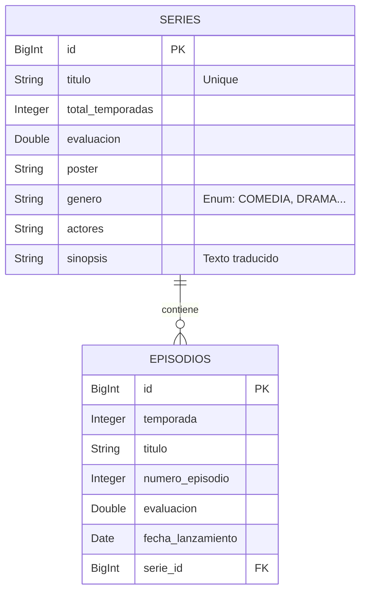
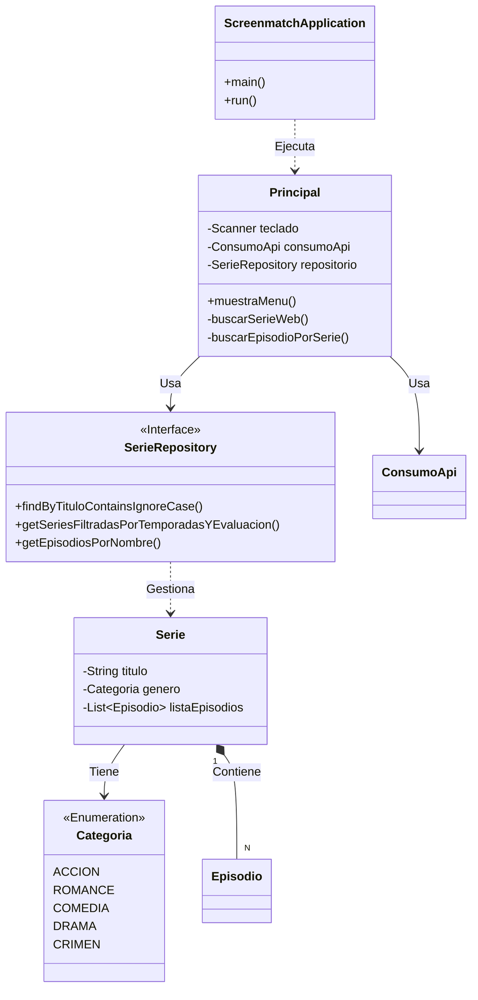
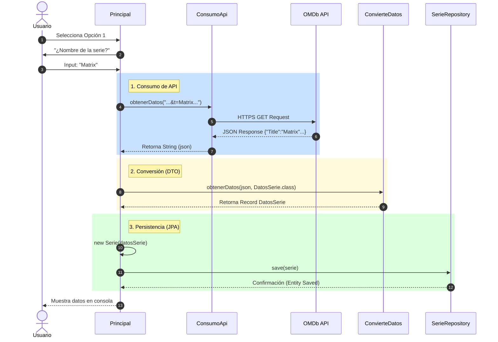

# 🎬 ScreenMatch Application

**ScreenMatch** es una robusta aplicación de backend desarrollada en Java con Spring Boot que gestiona un catálogo personal de series de televisión. El sistema consume la API de **OMDb** para obtener metadatos en tiempo real, deserializa la información utilizando **Java Records** y persiste los datos en una base de datos relacional **PostgreSQL**.

La aplicación destaca por transformar datos crudos en un modelo de dominio rico, permitiendo realizar análisis estadísticos, traducciones automáticas de sinopsis y consultas complejas a la base de datos.

## 🚀 Funcionalidades Principales

El sistema se controla mediante un menú interactivo en consola que ofrece las siguientes capacidades:

1.  **Consumo de API y Persistencia:**
    * Búsqueda de series por título en OMDb API.
    * Almacenamiento automático de la serie y su lista completa de episodios en la base de datos.
    * **Traducción automática:** Uso de la API *MyMemory* para traducir la sinopsis al español antes de guardar.

2.  **Gestión de Datos (CRUD & JPA):**
    * Listado de series buscadas y guardadas previamente.
    * Visualización detallada de episodios por temporada.

3.  **Consultas Avanzadas y Filtros:**
    * **Búsqueda por coincidencia de texto:** Encuentra series escribiendo solo una parte del título.
    * **Filtrado por Categoría:** Clasificación automática de géneros (Drama, Crimen, Comedia, etc.) mapeados desde el inglés.
    * **Filtros combinados (JPA):** Búsqueda granular por número máximo de temporadas y una evaluación mínima específica.
    * **Búsqueda de Episodios:** Localización de episodios específicos por fragmentos de su título dentro de la base de datos.

4.  **Estadísticas y Análisis:**
    * **Top 5 Series:** Ranking de las mejores series según la evaluación de IMDb.
    * **Top 5 Episodios:** Ranking de los mejores capítulos dentro de una serie específica.

## 🛠️ Tecnologías Utilizadas

* **Java 17:** Uso de características modernas como `Records` para DTOs y `Streams`.
* **Spring Boot 3:** Framework principal para la inyección de dependencias y configuración automática.
* **Spring Data JPA:** Abstracción para la persistencia de datos y creación de *Derived Queries*.
* **PostgreSQL:** Motor de base de datos relacional.
* **Hibernate:** Implementación de JPA para el mapeo Objeto-Relacional (ORM).
* **Jackson:** Librería para la deserialización de respuestas JSON (`@JsonAlias`, `@JsonIgnoreProperties`).
* **OMDb API:** Fuente externa de datos de películas y series.
* **MyMemory API:** Servicio utilizado para la traducción de textos.
* **Maven:** Gestión de dependencias y construcción del proyecto.

---

## 🔌 Servicios e Integraciones

La arquitectura del proyecto separa la lógica de negocio de la comunicación externa mediante un paquete de servicios dedicados:

### 1. Consumo de APIs (Cliente HTTP)
La clase `ConsumoApi` centraliza todas las peticiones web utilizando `java.net.http.HttpClient`, permitiendo obtener las respuestas en formato JSON crudo (Raw JSON) desde cualquier URL proporcionada.

### 2. Deserialización de Datos (JSON a Java)
Se implementa un mecanismo genérico mediante la interfaz `IConvierteDatos`.
* **Implementación:** `ConvierteDatos` utiliza la librería **Jackson** (`ObjectMapper`) para transformar las cadenas JSON provenientes de la API de OMDb en los **Records** del modelo (`DatosSerie`, `DatosEpisodio`, etc.).

### 3. Módulo de Traducción (Multiservicio)
Para mejorar la experiencia del usuario, las sinopsis de las series (originalmente en inglés) son traducidas automáticamente al español antes de guardarse en la base de datos. El proyecto incluye implementaciones para tres proveedores distintos:

* **MyMemory API (Translated.net):** *Servicio activo por defecto.* Utiliza `URLEncoder` para el manejo de cadenas y **Gson** para procesar la respuesta. No requiere API Key para uso moderado.
* **Google Gemini API:** Implementación alternativa preparada para usar el modelo `gemini-2.0-flash`.
* **OpenAI API (ChatGPT):** Implementación alternativa para el modelo `gpt-3.5-turbo-instruct`.

> **Nota:** Para activar Gemini u OpenAI, se requiere configurar las respectivas API KEYS en las clases de servicio.

---

## ⚙️ Configuración y Ejecución

### Prerrequisitos
1.  **Java 17** o superior.
2.  **Maven** instalado.
3.  **PostgreSQL** ejecutándose localmente.
4.  Una **API Key** de [OMDb API](http://www.omdbapi.com/apikey.aspx).

### Variables de Entorno
Por seguridad, la API Key de OMDb no está hardcodeada en el código. Debes configurar la siguiente variable de entorno en tu sistema operativo o en tu IDE (IntelliJ IDEA):

* `OMDB_KEY`: Tu clave personal de OMDb.

> **Nota:** Si decides usar los servicios de traducción de Google o OpenAI, deberás agregar también sus respectivas keys en las clases `ConsultaGemini` o `ConsultaChatGpt`.

### Base de Datos
Asegúrate de tener una base de datos creada en PostgreSQL llamada `screenmatch` (o el nombre que hayas definido en tu `application.properties`). Spring Data JPA se encargará de crear las tablas automáticamente (`ddl-auto=update`).

---

## 📊 Diagramas de Arquitectura

Los siguientes diagramas ilustran la estructura interna del proyecto.

### 1. Diagrama de Base de Datos (Entity-Relationship)
Muestra la relación **1:N** entre Series y Episodios, gestionada por JPA.

### 2. Diagrama de Clases (Estructura Principal)
Relación entre las clases de Modelo, Repositorio y la lógica de Principal.

### 3. Diagrama de Secuencia: Flujo Completo (Opción 1 - Buscar y Guardar)
Este diagrama detalla el proceso completo: desde que el usuario solicita una serie, el sistema la busca en OMDb, convierte el JSON a objetos Java y finalmente la persiste en PostgreSQL.

---

Desarrollado por [Yamil Rafart](https://github.com/yamilrafart2)